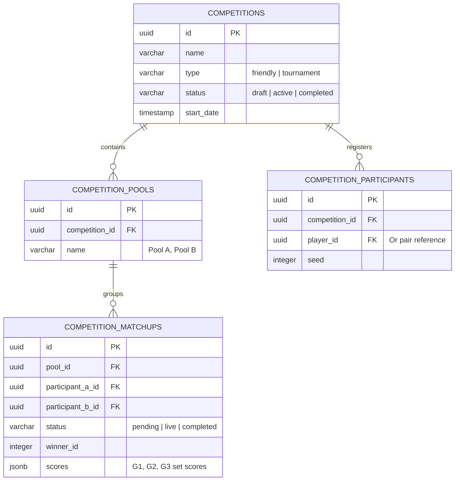

# KelabSukan Competition & Tournament Management Rules

This skill governs the backend structures and frontend layouts for all tournament and friendly match features on the KelabSukan Live Sports Network. Use this skill when managing the unified database schema, computing pool standings, or building playoff brackets.

## When to Apply

Reference these guidelines when:
- Creating, modifying, or querying competition tables in Supabase
- Building or refactoring the tournament standings tab
- Rendering elimination brackets (single/double elimination trees)
- Customizing BWF broadcast-style scoreboards or matchup rows

---

## 1. Unified Database Schema

To prevent duplication between "friendlies" and "tournaments", all competition events must use the unified schema structure. Do not create isolated table pairs for friendlies.



---

## 2. BWF Broadcast Scoreboard UI Rules

All competition matchups must be rendered in a broadcast-style layout, prioritizing player visual assets over plain text.

```text
+-------------------------------------------------------------+
| COURT 1 - LIVE                                  [ H2H: 3-2 ]|
|-------------------------------------------------------------|
| ( Avatar )  Amir [Rank #12]       | G1: 21 | G2: 18 | G3: 21 |
| ( Avatar )  Tan  [Rank #8]        | G1: 19 | G2: 21 | G3: 17 |
+-------------------------------------------------------------+
```

### Layout Specifications:
- **Player Cards (Hero of Matchup)**: Always render matchups with player identity cards (circular avatar with rank overlay, location details, career record, and recent form).
- **Winner Highlighting**: Highlight the winner's set scores in **Electric Lime** (`var(--arena-lime)`). Dim the loser's score using `text-[var(--arena-text-dim)]`.
- **Game-by-Game Detail**: Ensure set scores (e.g. G1, G2, G3) are aligned columns and expandable to reveal individual point progressions below the matchup card.
- **Series History Bar**: When clubs compete (e.g., Club A vs Club B), display a dual-colored progress bar representing all-time head-to-head records.

---

## 3. Pool Standings Calculations

Standings within competition pools must be computed programmatically using the following priority order:

1. **Match Wins**: Total matches won.
2. **Set Difference**: Total sets won minus sets lost.
3. **Point Difference**: Total individual points scored minus points conceded.
4. **Head-to-Head**: Direct matchup result if two players are tied.

> [!TIP]
> Always run pool standings calculations database-side (via RPC) or cache results to avoid client-side CPU thrashing when a pool has more than 10 players.

---

## 4. Playoff Bracket trees (SVG + CSS)

Playoff brackets must draw clean elimination paths from rounds (Quarterfinals, Semifinals, Finals) to the champion node.

- **Responsive SVG Connectors**: Render brackets in a flex grid (columns for rounds) and use SVG `<path>` lines to connect nodes.
- **Path Highlighting**: Highlight the winning bracket path in **Electric Lime** (`var(--arena-lime)`) and active/live paths in **Electric Blue** (`var(--arena-blue)`).
- **No Overflow**: Use horizontal scroll tags or swipe gestures on mobile viewports to prevent the tree layout from overflowing.
