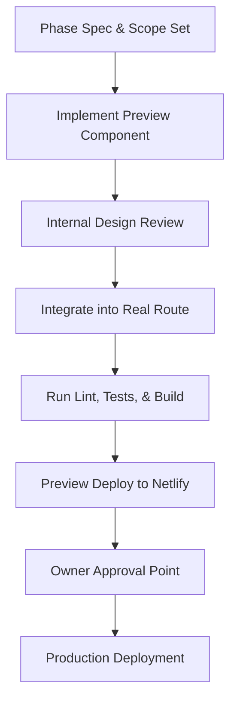

# KelabSukan Agent Project Management & Compliance Rules

This skill defines the operational guardrails, development sequencing, and branch management protocols for all developer agents working on the KelabSukan Live Sports Network. Use this skill to coordinate parallel lanes, execute phase handoffs, and manage project compliance.

## When to Apply

Reference these guidelines when:
- Initializing or structuring a new development phase
- Creating, updating, or reviewing the `task.md` or `walkthrough.md` files
- Working in a git worktree or branching environment
- Modifying files designated as high-risk collision points
- Reviewing phase gates before requesting owner approval

---

## 1. Git Branching & Worktree Discipline

To maintain a clean main branch and prevent file collision between parallel agent tasks, execute work in isolated git worktrees or branches.

### Recommended Worktree Commands
If working on multiple modules concurrently (e.g., UI design vs. database schema updates), run:
```bash
git worktree add ../badminton-v2-<sprint-name> -b codex/<sprint-name>
```

### Standard Sprint Branch Naming
- UI System: `codex/ui-design-system`
- Player Profile: `codex/player-card` or `codex/player-home`
- Competitions Page: `codex/club-homepage` or `codex/game-day-live`
- Database & RPCs: `codex/supabase-contract`
- Testing & Audit: `codex/qa-phase-1`

> [!WARNING]
> Never run multiple agents concurrently in a dirty working directory. Ensure all local changes are stashed or committed before initiating parallel operations.

---

## 2. High-Risk Collision Files

The following files represent core shared modules. Only **one agent** should edit any of these files during an active sprint phase. Other agents may read these files but must not make edits unless assigned as the single owner:

- [src/App.tsx](file:///Users/abc/Documents/Badminton%20v2/src/App.tsx)
- [src/main.tsx](file:///Users/abc/Documents/Badminton%20v2/src/main.tsx)
- [src/index.css](file:///Users/abc/Documents/Badminton%20v2/src/index.css)
- [src/App.css](file:///Users/abc/Documents/Badminton%20v2/src/App.css)
- [src/lib/api.ts](file:///Users/abc/Documents/Badminton%20v2/src/lib/api.ts) (Or its replacement modules)
- [src/context/AuthContext.tsx](file:///Users/abc/Documents/Badminton%20v2/src/context/AuthContext.tsx)
- [src/context/NotificationsContext.tsx](file:///Users/abc/Documents/Badminton%20v2/src/context/NotificationsContext.tsx)
- [src/types/database.ts](file:///Users/abc/Documents/Badminton%20v2/src/types/database.ts)
- [netlify.toml](file:///Users/abc/Documents/Badminton%20v2/netlify.toml)
- `supabase/migrations/`
- [KELABSUKAN_TRUE_NORTH.md](file:///Users/abc/Documents/Badminton%20v2/KELABSUKAN_TRUE_NORTH.md)

---

## 3. Mandatory Build & Phase Gates

Every phase must enforce the following sequence to guarantee quality control:



### Checklist for Phase Completion
1. **Lint Check**: Run `npm run lint` and verify **0 errors**.
2. **Test Check**: Run `npm run test` and confirm all test suites pass.
3. **Build Check**: Run `npm run build` to confirm output compilation.
4. **Viewport Check**: Verify UI layout under mobile (390px) and desktop (1440px) scales.
5. **No Placeholders**: Ensure all static copy is final and images use generated assets rather than layout fillers.

---

## 4. Keeping Track: task.md and walkthrough.md

Agents must document their work in progress and final deliverables to ensure transparency and rapid recovery.

### Updating task.md
Maintain a living checklist at `<appDataDir>/brain/<conversation-id>/task.md`.
- Use `[/]` for items currently in progress.
- Use `[x]` for items completed.
- Provide descriptive, granular tasks to isolate logic blocks.

### Compiling walkthrough.md
On completion of work, generate a summary walkthrough at `<appDataDir>/brain/<conversation-id>/walkthrough.md`.
- Detail the exact files modified, added, or deleted.
- Highlight the verification steps performed.
- Embed any preview URLs or generated UI mockups.
